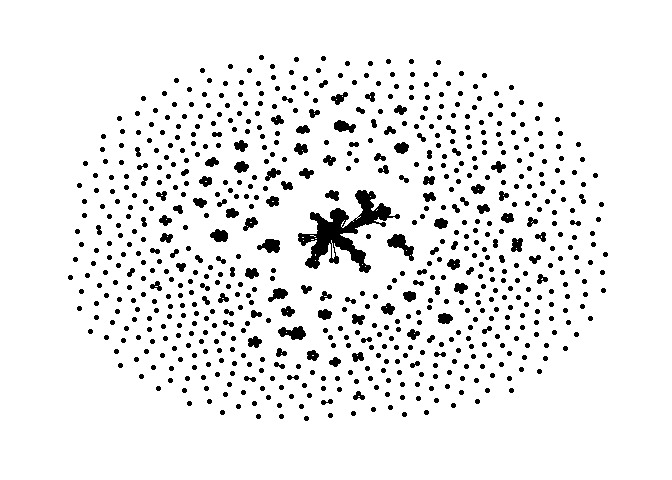
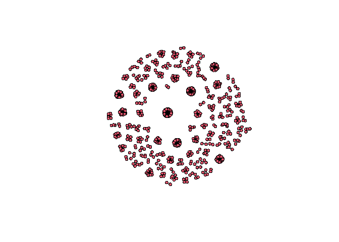

Exercise 1 Carlos Fabbri
================

## Read the data

``` r
data = read.csv('Connections.csv', encoding = 'UTF-8')
```

``` r
library(dplyr)
```

    ## 
    ## Attaching package: 'dplyr'

    ## The following objects are masked from 'package:stats':
    ## 
    ##     filter, lag

    ## The following objects are masked from 'package:base':
    ## 
    ##     intersect, setdiff, setequal, union

``` r
data %>% group_by(Company) %>% count() %>% arrange(desc(n))
```

    ## # A tibble: 792 x 2
    ## # Groups:   Company [792]
    ##    Company                                                   n
    ##    <chr>                                                 <int>
    ##  1 "Belcorp"                                                64
    ##  2 "McGill University - Desautels Faculty of Management"    23
    ##  3 "Banco de Crédito BCP"                                   19
    ##  4 "Interbank"                                              19
    ##  5 ""                                                       18
    ##  6 "Scotiabank"                                             16
    ##  7 "Entel Perú"                                             15
    ##  8 "Rappi"                                                  13
    ##  9 "Alicorp"                                                12
    ## 10 "EY"                                                     12
    ## # ... with 782 more rows

``` r
names(data)
```

``` r
library(tidyverse)
```

    ## -- Attaching packages --------------------------------------- tidyverse 1.3.1 --

    ## v ggplot2 3.3.5     v purrr   0.3.4
    ## v tibble  3.1.4     v stringr 1.4.0
    ## v tidyr   1.1.3     v forcats 0.5.1
    ## v readr   2.0.1

    ## -- Conflicts ------------------------------------------ tidyverse_conflicts() --
    ## x dplyr::filter() masks stats::filter()
    ## x dplyr::lag()    masks stats::lag()

``` r
library(tidygraph)
```

    ## Warning: package 'tidygraph' was built under R version 4.1.3

    ## 
    ## Attaching package: 'tidygraph'

    ## The following object is masked from 'package:stats':
    ## 
    ##     filter

``` r
library(ggraph)
```

    ## Warning: package 'ggraph' was built under R version 4.1.3

``` r
data$Last_name_initial = substr(data$Last.Name, 1,1)


data = data %>% mutate(
  name = paste(First.Name, Last_name_initial, sep = " ")
)

data$index <- 1:nrow(data)

nodes <- data %>% select(c("name", "Company"))

nodes <- nodes %>% rowid_to_column("id")

edges <- data %>% select(c(name, Company)) %>% 
  left_join(nodes %>% select(c(id,name)), by = c("name"="name"))

edges <- edges %>% left_join(edges, by = "Company", keep=FALSE) %>% 
  select(c("id.x", "id.y", "Company")) %>% 
  filter(id.x!=id.y)


colnames(edges) <- c("x", "y", "Company")

graph <- tbl_graph(edges = edges, nodes=nodes, directed = FALSE)

ggraph(graph, layout = "graphopt") + 
  geom_edge_link( show.legend = FALSE) + 
  geom_node_point()+
  theme_graph()
```

<!-- -->

## Another method using network library

``` r
df1 <- data.frame()

# iterate through each company and generate the edges 
for (company in unique(data$Company) ){
  
company_edges = data %>% filter(Company==company) %>% pull(index)

edges = expand.grid(company_edges, company_edges)

# remove the connections with themselves
edges = edges %>% filter(Var1 != Var2)

# append to main df1
df1 <- rbind(df1, edges)

#print(dim(df1))
  
}

# nodes = data$index
# edges = df1

df1$temp <- apply(df1, 1, function(x) paste(sort(x), collapse=""))

df1 = df1[!duplicated(df1$temp), 1:2] # remove duplicate (each combination appears once)

df1
```

``` r
library(tidygraph)
#install.packages('network')
library(network)
```

    ## Warning: package 'network' was built under R version 4.1.3

    ## 
    ## 'network' 1.17.1 (2021-06-12), part of the Statnet Project
    ## * 'news(package="network")' for changes since last version
    ## * 'citation("network")' for citation information
    ## * 'https://statnet.org' for help, support, and other information

``` r
linkedin_network <- network(df1, attr = data,  matrix.type = "edgelist",directed=FALSE)

linkedin_network
```

    ##  Network attributes:
    ##   vertices = 635 
    ##   directed = FALSE 
    ##   hyper = FALSE 
    ##   loops = FALSE 
    ##   multiple = FALSE 
    ##   bipartite = FALSE 
    ##   total edges= 3860 
    ##     missing edges= 0 
    ##     non-missing edges= 3860 
    ## 
    ##  Vertex attribute names: 
    ##     vertex.names 
    ## 
    ##  Edge attribute names not shown

``` r
plot(linkedin_network )
```

<!-- -->

``` r
#to do: print names of nodes
```
