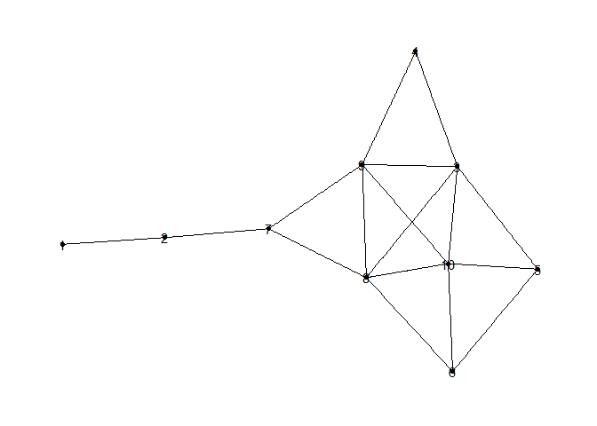

Exercise 2
================

``` r
library(dplyr)
```

    ## 
    ## Attaching package: 'dplyr'

    ## The following objects are masked from 'package:stats':
    ## 
    ##     filter, lag

    ## The following objects are masked from 'package:base':
    ## 
    ##     intersect, setdiff, setequal, union

``` r
library(tidygraph)
```

    ## Warning: package 'tidygraph' was built under R version 4.1.3

    ## 
    ## Attaching package: 'tidygraph'

    ## The following object is masked from 'package:stats':
    ## 
    ##     filter

``` r
library(tidyverse)
```

    ## -- Attaching packages --------------------------------------- tidyverse 1.3.1 --

    ## v ggplot2 3.3.5     v purrr   0.3.4
    ## v tibble  3.1.4     v stringr 1.4.0
    ## v tidyr   1.1.3     v forcats 0.5.1
    ## v readr   2.0.1

    ## -- Conflicts ------------------------------------------ tidyverse_conflicts() --
    ## x tidygraph::filter() masks dplyr::filter(), stats::filter()
    ## x dplyr::lag()        masks stats::lag()

``` r
library(ggraph)
```

    ## Warning: package 'ggraph' was built under R version 4.1.3

``` r
df = read.csv('Fakebook_edges.csv')
df
```

    ##     X  Y
    ## 1   6  5
    ## 2   6 10
    ## 3   6  8
    ## 4   5  6
    ## 5   5 10
    ## 6   5  3
    ## 7  10  6
    ## 8  10  5
    ## 9  10  3
    ## 10 10  8
    ## 11 10  9
    ## 12  3  5
    ## 13  3 10
    ## 14  3  4
    ## 15  3  8
    ## 16  3  9
    ## 17  4  3
    ## 18  4  9
    ## 19  8  6
    ## 20  8 10
    ## 21  8  3
    ## 22  8  9
    ## 23  8  7
    ## 24  9  3
    ## 25  9  4
    ## 26  9 10
    ## 27  9  8
    ## 28  9  7
    ## 29  7  8
    ## 30  7  2
    ## 31  7  9
    ## 32  2  7
    ## 33  2  1
    ## 34  1  2

``` r
graph = as_tbl_graph(df)

#https://www.data-imaginist.com/2017/introducing-tidygraph/
# printing the network
ggraph(graph) + 
  geom_edge_link() + 
  geom_node_point()+
  geom_node_text(aes(label = name)) +
  theme_graph()
```

    ## Using `stress` as default layout

<!-- -->

``` r
# centrality degree: counting edges of each note
graph =graph %>%
  activate(nodes) %>%
  mutate(centrality_degree = centrality_degree())

graph
```

    ## # A tbl_graph: 10 nodes and 34 edges
    ## #
    ## # A directed simple graph with 1 component
    ## #
    ## # Node Data: 10 x 2 (active)
    ##   name  centrality_degree
    ##   <chr>             <dbl>
    ## 1 6                     3
    ## 2 5                     3
    ## 3 10                    5
    ## 4 3                     5
    ## 5 4                     2
    ## 6 8                     5
    ## # ... with 4 more rows
    ## #
    ## # Edge Data: 34 x 2
    ##    from    to
    ##   <int> <int>
    ## 1     1     2
    ## 2     1     3
    ## 3     1     6
    ## # ... with 31 more rows

``` r
# centrality degree: counting edges of each note
graph = graph %>%
  activate(nodes) %>%
  mutate(centrality_betweenness = centrality_betweenness())
```

    ## Warning in betweenness(graph = graph, v = V(graph), directed = directed, :
    ## 'nobigint' is deprecated since igraph 1.3 and will be removed in igraph 1.4

``` r
graph %>% 
  filter(name %in% c(7,8,9,10))
```

    ## # A tbl_graph: 4 nodes and 10 edges
    ## #
    ## # A directed simple graph with 1 component
    ## #
    ## # Node Data: 4 x 3 (active)
    ##   name  centrality_degree centrality_betweenness
    ##   <chr>             <dbl>                  <dbl>
    ## 1 10                    5                   6.53
    ## 2 8                     5                  18.1 
    ## 3 9                     5                  17.2 
    ## 4 7                     3                  28   
    ## #
    ## # Edge Data: 10 x 2
    ##    from    to
    ##   <int> <int>
    ## 1     1     2
    ## 2     1     3
    ## 3     2     1
    ## # ... with 7 more rows

Based on the computations of degree and betweenness centralities, we can
see that spots B (8) and A (7) are the most appealing to sit in. First,
between spots B,C,D, they all share the same centrality degree of 5 (5
edges each), so the thing that sets them apart is the centrality
betweenness –how valuable is their position to bring together separate
‘cliques’ in the network–. From there we can see that B is the
preferable spot. Going further, we see that spot A (7) has a notably
lower degree centrality, but however outshines the rest in terms of
betweenness score.

Therefore, it will depend more on the intern and his/her intentions or
preferences for relationship building to decide which of these 2 to
select. In my opinion, considering an internship of 3 months, I think it
is better to maximize the amount of trusting relationships built, so I
lean towards choosing seat B.
