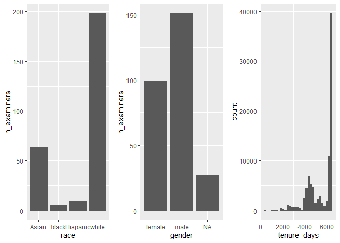
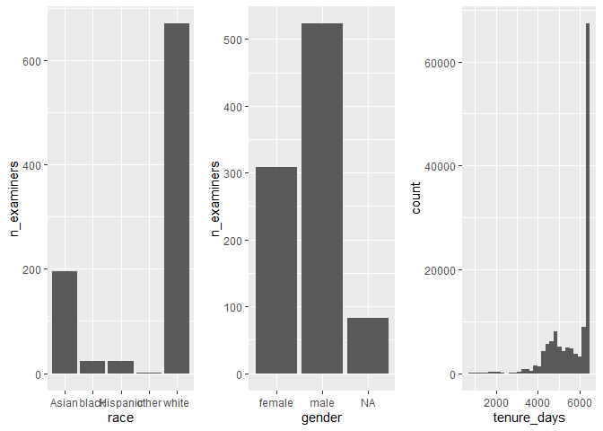
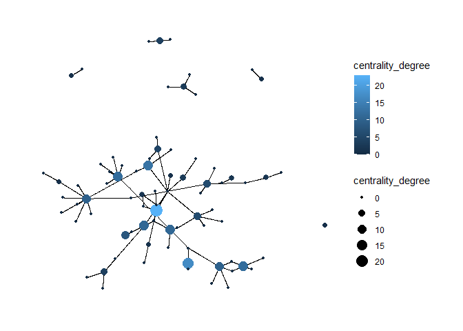
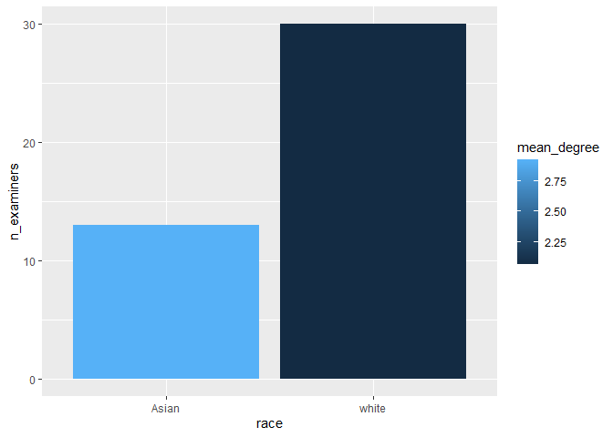
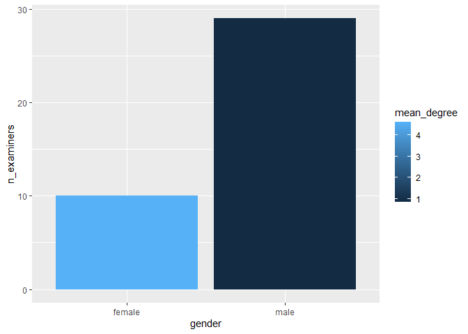
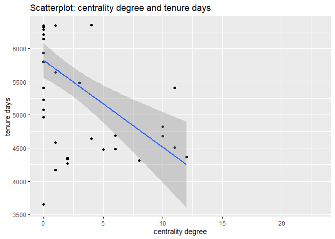
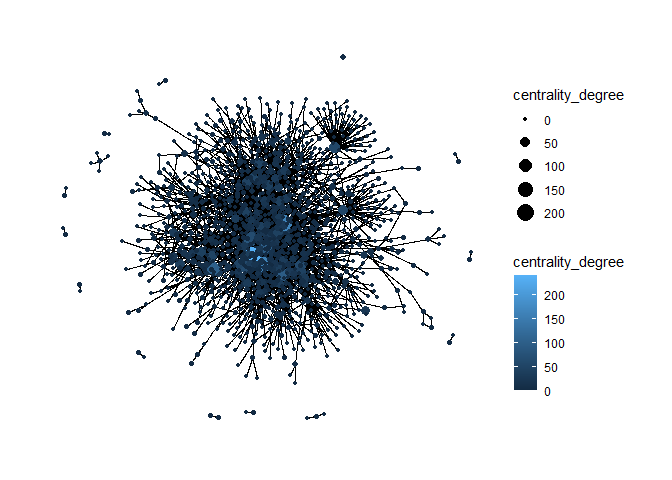
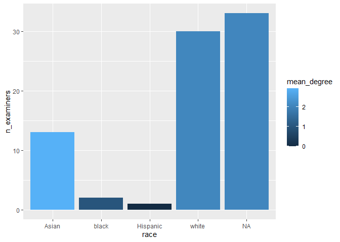
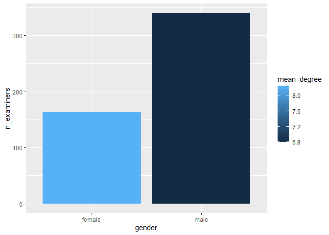
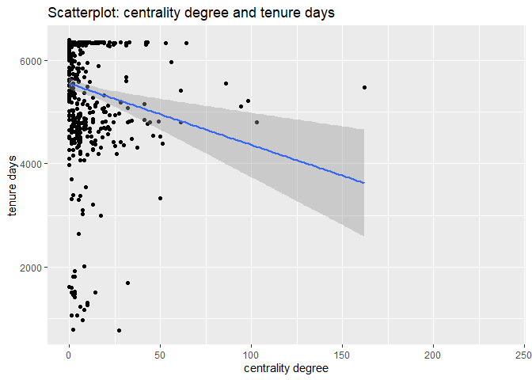

Exercise 3
================

``` r
install.packages('arrow')
install.packages('wru')
```

## Load data

Load the following data: + applications from `app_data_sample.parquet` +
edges from `edges_sample.csv`

``` r
# change to your own path!
applications <- read_parquet("app_data_sample.parquet")
edges <- read_csv("edges_sample.csv")
```

    ## Rows: 32906 Columns: 4

    ## -- Column specification --------------------------------------------------------
    ## Delimiter: ","
    ## chr  (1): application_number
    ## dbl  (2): ego_examiner_id, alter_examiner_id
    ## date (1): advice_date

    ## 
    ## i Use `spec()` to retrieve the full column specification for this data.
    ## i Specify the column types or set `show_col_types = FALSE` to quiet this message.

``` r
applications
```

    ## # A tibble: 2,018,477 x 16
    ##    application_number filing_date examiner_name_last examiner_name_first
    ##    <chr>              <date>      <chr>              <chr>              
    ##  1 08284457           2000-01-26  HOWARD             JACQUELINE         
    ##  2 08413193           2000-10-11  YILDIRIM           BEKIR              
    ##  3 08531853           2000-05-17  HAMILTON           CYNTHIA            
    ##  4 08637752           2001-07-20  MOSHER             MARY               
    ##  5 08682726           2000-04-10  BARR               MICHAEL            
    ##  6 08687412           2000-04-28  GRAY               LINDA              
    ##  7 08716371           2004-01-26  MCMILLIAN          KARA               
    ##  8 08765941           2000-06-23  FORD               VANESSA            
    ##  9 08776818           2000-02-04  STRZELECKA         TERESA             
    ## 10 08809677           2002-02-20  KIM                SUN                
    ## # ... with 2,018,467 more rows, and 12 more variables:
    ## #   examiner_name_middle <chr>, examiner_id <dbl>, examiner_art_unit <dbl>,
    ## #   uspc_class <chr>, uspc_subclass <chr>, patent_number <chr>,
    ## #   patent_issue_date <date>, abandon_date <date>, disposal_type <chr>,
    ## #   appl_status_code <dbl>, appl_status_date <chr>, tc <dbl>

``` r
edges
```

    ## # A tibble: 32,906 x 4
    ##    application_number advice_date ego_examiner_id alter_examiner_id
    ##    <chr>              <date>                <dbl>             <dbl>
    ##  1 09402488           2008-11-17            84356             66266
    ##  2 09402488           2008-11-17            84356             63519
    ##  3 09402488           2008-11-17            84356             98531
    ##  4 09445135           2008-08-21            92953             71313
    ##  5 09445135           2008-08-21            92953             93865
    ##  6 09445135           2008-08-21            92953             91818
    ##  7 09479304           2008-12-15            61767             69277
    ##  8 09479304           2008-12-15            61767             92446
    ##  9 09479304           2008-12-15            61767             66805
    ## 10 09479304           2008-12-15            61767             70919
    ## # ... with 32,896 more rows

## Get gender for examiners

We’ll get gender based on the first name of the examiner, which is
recorded in the field `examiner_name_first`. We’ll use library `gender`
for that, relying on a modified version of their own
[example](https://cran.r-project.org/web/packages/gender/vignettes/predicting-gender.html).

Note that there are over 2 million records in the applications table –
that’s because there are many records for each examiner, as many as the
number of applications that examiner worked on during this time frame.
Our first step therefore is to get all *unique* names in a separate list
`examiner_names`. We will then guess gender for each one and will join
this table back to the original dataset. So, let’s get names without
repetition:

``` r
library(gender)
```

    ## Warning: package 'gender' was built under R version 4.1.2

``` r
#install_genderdata_package() # only run this line the first time you use the package, to get data for it
# get a list of first names without repetitions
examiner_names <- applications %>% 
  distinct(examiner_name_first)
examiner_names
```

    ## # A tibble: 2,595 x 1
    ##    examiner_name_first
    ##    <chr>              
    ##  1 JACQUELINE         
    ##  2 BEKIR              
    ##  3 CYNTHIA            
    ##  4 MARY               
    ##  5 MICHAEL            
    ##  6 LINDA              
    ##  7 KARA               
    ##  8 VANESSA            
    ##  9 TERESA             
    ## 10 SUN                
    ## # ... with 2,585 more rows

Now let’s use function `gender()` as shown in the example for the
package to attach a gender and probability to each name and put the
results into the table `examiner_names_gender`

``` r
# get a table of names and gender
examiner_names_gender <- examiner_names %>% 
  do(results = gender(.$examiner_name_first, method = "ssa")) %>% 
  unnest(cols = c(results), keep_empty = TRUE) %>% 
  select(
    examiner_name_first = name,
    gender,
    proportion_female
  )
examiner_names_gender
```

    ## # A tibble: 1,822 x 3
    ##    examiner_name_first gender proportion_female
    ##    <chr>               <chr>              <dbl>
    ##  1 AARON               male              0.0082
    ##  2 ABDEL               male              0     
    ##  3 ABDOU               male              0     
    ##  4 ABDUL               male              0     
    ##  5 ABDULHAKIM          male              0     
    ##  6 ABDULLAH            male              0     
    ##  7 ABDULLAHI           male              0     
    ##  8 ABIGAIL             female            0.998 
    ##  9 ABIMBOLA            female            0.944 
    ## 10 ABRAHAM             male              0.0031
    ## # ... with 1,812 more rows

Finally, let’s join that table back to our original applications data
and discard the temporary tables we have just created to reduce clutter
in our environment.

``` r
# remove extra colums from the gender table
examiner_names_gender <- examiner_names_gender %>% 
  select(examiner_name_first, gender)
# joining gender back to the dataset
applications <- applications %>% 
  left_join(examiner_names_gender, by = "examiner_name_first")
# cleaning up
rm(examiner_names)
rm(examiner_names_gender)
gc()
```

    ##            used  (Mb) gc trigger  (Mb) max used  (Mb)
    ## Ncells  4594336 245.4    8058565 430.4  4977117 265.9
    ## Vcells 49607548 378.5   92604264 706.6 79923091 609.8

## Guess the examiner’s race

We’ll now use package `wru` to estimate likely race of an examiner. Just
like with gender, we’ll get a list of unique names first, only now we
are using surnames.

``` r
library(wru)
```

    ## Warning: package 'wru' was built under R version 4.1.3

``` r
examiner_surnames <- applications %>% 
  select(surname = examiner_name_last) %>% 
  distinct()
examiner_surnames
```

    ## # A tibble: 3,806 x 1
    ##    surname   
    ##    <chr>     
    ##  1 HOWARD    
    ##  2 YILDIRIM  
    ##  3 HAMILTON  
    ##  4 MOSHER    
    ##  5 BARR      
    ##  6 GRAY      
    ##  7 MCMILLIAN 
    ##  8 FORD      
    ##  9 STRZELECKA
    ## 10 KIM       
    ## # ... with 3,796 more rows

We’ll follow the instructions for the package outlined here
<https://github.com/kosukeimai/wru>.

``` r
examiner_race <- predict_race(voter.file = examiner_surnames, surname.only = T) %>% 
  as_tibble()
```

    ## [1] "Proceeding with surname-only predictions..."

    ## Warning in merge_surnames(voter.file): Probabilities were imputed for 698
    ## surnames that could not be matched to Census list.

``` r
examiner_race
```

    ## # A tibble: 3,806 x 6
    ##    surname    pred.whi pred.bla pred.his pred.asi pred.oth
    ##    <chr>         <dbl>    <dbl>    <dbl>    <dbl>    <dbl>
    ##  1 HOWARD       0.643   0.295    0.0237   0.005     0.0333
    ##  2 YILDIRIM     0.861   0.0271   0.0609   0.0135    0.0372
    ##  3 HAMILTON     0.702   0.237    0.0245   0.0054    0.0309
    ##  4 MOSHER       0.947   0.00410  0.0241   0.00640   0.0185
    ##  5 BARR         0.827   0.117    0.0226   0.00590   0.0271
    ##  6 GRAY         0.687   0.251    0.0241   0.0054    0.0324
    ##  7 MCMILLIAN    0.359   0.574    0.0189   0.00260   0.0463
    ##  8 FORD         0.620   0.32     0.0237   0.0045    0.0313
    ##  9 STRZELECKA   0.666   0.0853   0.137    0.0797    0.0318
    ## 10 KIM          0.0252  0.00390  0.00650  0.945     0.0198
    ## # ... with 3,796 more rows

As you can see, we get probabilities across five broad US Census
categories: white, black, Hispanic, Asian and other. (Some of you may
correctly point out that Hispanic is not a race category in the US
Census, but these are the limitations of this package.)

Our final step here is to pick the race category that has the highest
probability for each last name and then join the table back to the main
applications table. See this example for comparing values across
columns: <https://www.tidyverse.org/blog/2020/04/dplyr-1-0-0-rowwise/>.
And this one for `case_when()` function:
<https://dplyr.tidyverse.org/reference/case_when.html>.

``` r
examiner_race <- examiner_race %>% 
  mutate(max_race_p = pmax(pred.asi, pred.bla, pred.his, pred.oth, pred.whi)) %>% 
  mutate(race = case_when(
    max_race_p == pred.asi ~ "Asian",
    max_race_p == pred.bla ~ "black",
    max_race_p == pred.his ~ "Hispanic",
    max_race_p == pred.oth ~ "other",
    max_race_p == pred.whi ~ "white",
    TRUE ~ NA_character_
  ))
examiner_race
```

    ## # A tibble: 3,806 x 8
    ##    surname    pred.whi pred.bla pred.his pred.asi pred.oth max_race_p race 
    ##    <chr>         <dbl>    <dbl>    <dbl>    <dbl>    <dbl>      <dbl> <chr>
    ##  1 HOWARD       0.643   0.295    0.0237   0.005     0.0333      0.643 white
    ##  2 YILDIRIM     0.861   0.0271   0.0609   0.0135    0.0372      0.861 white
    ##  3 HAMILTON     0.702   0.237    0.0245   0.0054    0.0309      0.702 white
    ##  4 MOSHER       0.947   0.00410  0.0241   0.00640   0.0185      0.947 white
    ##  5 BARR         0.827   0.117    0.0226   0.00590   0.0271      0.827 white
    ##  6 GRAY         0.687   0.251    0.0241   0.0054    0.0324      0.687 white
    ##  7 MCMILLIAN    0.359   0.574    0.0189   0.00260   0.0463      0.574 black
    ##  8 FORD         0.620   0.32     0.0237   0.0045    0.0313      0.620 white
    ##  9 STRZELECKA   0.666   0.0853   0.137    0.0797    0.0318      0.666 white
    ## 10 KIM          0.0252  0.00390  0.00650  0.945     0.0198      0.945 Asian
    ## # ... with 3,796 more rows

Let’s join the data back to the applications table.

``` r
# removing extra columns
examiner_race <- examiner_race %>% 
  select(surname,race)
applications <- applications %>% 
  left_join(examiner_race, by = c("examiner_name_last" = "surname"))
rm(examiner_race)
rm(examiner_surnames)
gc()
```

    ##            used  (Mb) gc trigger  (Mb) max used  (Mb)
    ## Ncells  5007030 267.5    8058565 430.4  8058565 430.4
    ## Vcells 53403538 407.5   92604264 706.6 91612079 699.0

``` r
# applications = applications %>% rename(race = race.x, gender = gender.x)

# applications = applications %>% select( -c(race.y, gender.y))

names(applications)
```

    ##  [1] "application_number"   "filing_date"          "examiner_name_last"  
    ##  [4] "examiner_name_first"  "examiner_name_middle" "examiner_id"         
    ##  [7] "examiner_art_unit"    "uspc_class"           "uspc_subclass"       
    ## [10] "patent_number"        "patent_issue_date"    "abandon_date"        
    ## [13] "disposal_type"        "appl_status_code"     "appl_status_date"    
    ## [16] "tc"                   "gender"               "race"

## Examiner’s tenure

To figure out the timespan for which we observe each examiner in the
applications data, let’s find the first and the last observed date for
each examiner. We’ll first get examiner IDs and application dates in a
separate table, for ease of manipulation. We’ll keep examiner ID (the
field `examiner_id`), and earliest and latest dates for each application
(`filing_date` and `appl_status_date` respectively). We’ll use functions
in package `lubridate` to work with date and time values.

``` r
library(lubridate) # to work with dates
examiner_dates <- applications %>% 
  select(examiner_id, filing_date, appl_status_date) 
examiner_dates
```

    ## # A tibble: 2,018,477 x 3
    ##    examiner_id filing_date appl_status_date  
    ##          <dbl> <date>      <chr>             
    ##  1       96082 2000-01-26  30jan2003 00:00:00
    ##  2       87678 2000-10-11  27sep2010 00:00:00
    ##  3       63213 2000-05-17  30mar2009 00:00:00
    ##  4       73788 2001-07-20  07sep2009 00:00:00
    ##  5       77294 2000-04-10  19apr2001 00:00:00
    ##  6       68606 2000-04-28  16jul2001 00:00:00
    ##  7       89557 2004-01-26  15may2017 00:00:00
    ##  8       97543 2000-06-23  03apr2002 00:00:00
    ##  9       98714 2000-02-04  27nov2002 00:00:00
    ## 10       65530 2002-02-20  23mar2009 00:00:00
    ## # ... with 2,018,467 more rows

The dates look inconsistent in terms of formatting. Let’s make them
consistent. We’ll create new variables `start_date` and `end_date`.

``` r
examiner_dates <- examiner_dates %>% 
  mutate(start_date = ymd(filing_date), end_date = as_date(dmy_hms(appl_status_date)))
```

Let’s now identify the earliest and the latest date for each examiner
and calculate the difference in days, which is their tenure in the
organization.

``` r
examiner_dates <- examiner_dates %>% 
  group_by(examiner_id) %>% 
  summarise(
    earliest_date = min(start_date, na.rm = TRUE), 
    latest_date = max(end_date, na.rm = TRUE),
    tenure_days = interval(earliest_date, latest_date) %/% days(1)
    ) %>% 
    filter(year(latest_date)<2018)
examiner_dates
```

    ## # A tibble: 5,625 x 4
    ##    examiner_id earliest_date latest_date tenure_days
    ##          <dbl> <date>        <date>            <dbl>
    ##  1       59012 2004-07-28    2015-07-24         4013
    ##  2       59025 2009-10-26    2017-05-18         2761
    ##  3       59030 2005-12-12    2017-05-22         4179
    ##  4       59040 2007-09-11    2017-05-23         3542
    ##  5       59052 2001-08-21    2007-02-28         2017
    ##  6       59054 2000-11-10    2016-12-23         5887
    ##  7       59055 2004-11-02    2007-12-26         1149
    ##  8       59056 2000-03-24    2017-05-22         6268
    ##  9       59074 2000-01-31    2017-03-17         6255
    ## 10       59081 2011-04-21    2017-05-19         2220
    ## # ... with 5,615 more rows

Joining back to the applications data.

``` r
applications <- applications %>% 
  left_join(examiner_dates, by = "examiner_id")
rm(examiner_dates)
gc()
```

    ##            used  (Mb) gc trigger   (Mb)  max used   (Mb)
    ## Ncells  5020384 268.2   14618102  780.7  14618102  780.7
    ## Vcells 65781138 501.9  133526139 1018.8 133370052 1017.6

``` r
save(applications,file="applications.Rda")
save(edges,file="edges")
```

## Network Analysis

After running the code to generate the 3 new features: gender, race and
tenure, we proceed to analyze the connections in the network by sampling
2 workgroups.

``` r
load(file='applications.Rda')

load(file='edges')


names(applications)
```

    ##  [1] "application_number"   "filing_date"          "examiner_name_last"  
    ##  [4] "examiner_name_first"  "examiner_name_middle" "examiner_id"         
    ##  [7] "examiner_art_unit"    "uspc_class"           "uspc_subclass"       
    ## [10] "patent_number"        "patent_issue_date"    "abandon_date"        
    ## [13] "disposal_type"        "appl_status_code"     "appl_status_date"    
    ## [16] "tc"                   "gender"               "race"                
    ## [19] "earliest_date"        "latest_date"          "tenure_days"

``` r
names(edges)
```

    ## [1] "application_number" "advice_date"        "ego_examiner_id"   
    ## [4] "alter_examiner_id"

``` r
applications %>% count(examiner_art_unit, sort = TRUE)
```

    ## # A tibble: 291 x 2
    ##    examiner_art_unit     n
    ##                <dbl> <int>
    ##  1              1625 25419
    ##  2              1626 24930
    ##  3              1624 24586
    ##  4              1797 24128
    ##  5              1621 20440
    ##  6              1796 19589
    ##  7              1793 18513
    ##  8              1765 18347
    ##  9              1762 18222
    ## 10              1761 17590
    ## # ... with 281 more rows

``` r
# Choosing workgroups 176 and 179
wg1 = applications %>% filter(substr(examiner_art_unit, 1, 3) == '176' ) %>% 
  arrange(application_number)

wg2 = applications %>% filter(substr(examiner_art_unit, 1, 3) == '179' ) %>% 
  arrange(application_number)

#summary(wg1)


# distributions for wg 176
p1 = wg1 %>% group_by(race) %>% summarise(n_examiners = n_distinct(examiner_id)) %>% 
  ggplot(aes(x = race, y = n_examiners)) + geom_bar(stat ='identity')

p2 = wg1 %>% group_by(gender) %>% summarise(n_examiners = n_distinct(examiner_id)) %>% 
  ggplot(aes(x = gender, y = n_examiners)) + geom_bar(stat ='identity')

p3 = wg1 %>% ggplot(aes(x = tenure_days)) + geom_histogram()

library(gridExtra)
```

    ## 
    ## Attaching package: 'gridExtra'

    ## The following object is masked from 'package:dplyr':
    ## 
    ##     combine

``` r
par(mfrow=c(1,3))
grid.arrange(p1, p2, p3, ncol=3)
```

    ## `stat_bin()` using `bins = 30`. Pick better value with `binwidth`.

    ## Warning: Removed 1017 rows containing non-finite values (stat_bin).

<!-- -->

``` r
# distributions for wg 179
p1 = wg2 %>% group_by(race) %>% summarise(n_examiners = n_distinct(examiner_id)) %>% 
  ggplot(aes(x = race, y = n_examiners)) + geom_bar(stat ='identity')

p2 = wg2 %>% group_by(gender) %>% summarise(n_examiners = n_distinct(examiner_id)) %>% 
  ggplot(aes(x = gender, y = n_examiners)) + geom_bar(stat ='identity')

p3 = wg2 %>% ggplot(aes(x = tenure_days)) + geom_histogram()

par(mfrow=c(1,3))
grid.arrange(p1, p2, p3, ncol=3)
```

    ## `stat_bin()` using `bins = 30`. Pick better value with `binwidth`.

    ## Warning: Removed 1058 rows containing non-finite values (stat_bin).

<!-- -->

## Creating advice networks

``` r
#finding edges of first workgroup. We keep the edges of applications that belong to wg1
edges_wg1 = edges %>% inner_join(wg1[c('application_number')] , by = 'application_number') 
edges_wg1  = drop_na(edges_wg1)

names(edges_wg1)
```

    ## [1] "application_number" "advice_date"        "ego_examiner_id"   
    ## [4] "alter_examiner_id"

``` r
dim(edges_wg1)
```

    ## [1] 170   4

``` r
#creating the network object
library(tidygraph)
```

    ## Warning: package 'tidygraph' was built under R version 4.1.3

    ## 
    ## Attaching package: 'tidygraph'

    ## The following object is masked from 'package:stats':
    ## 
    ##     filter

``` r
library(tidyverse)
library(ggraph)
```

    ## Warning: package 'ggraph' was built under R version 4.1.3

``` r
edges_wg1 = edges_wg1 %>% rename(to = alter_examiner_id ,
                     from = ego_examiner_id )

graph = as_tbl_graph(x = edges_wg1[c('to','from')])

graph = graph %>%
  activate(nodes) %>%
  mutate(centrality_degree = centrality_degree())

ggraph(graph, layout = 'graphopt') + 
  geom_edge_link()+
  geom_node_point(aes(size = centrality_degree, colour = centrality_degree))+
 theme_graph()
```

    ## Warning in grid.Call(C_stringMetric, as.graphicsAnnot(x$label)): font family not
    ## found in Windows font database

    ## Warning in grid.Call(C_stringMetric, as.graphicsAnnot(x$label)): font family not
    ## found in Windows font database

    ## Warning in grid.Call(C_textBounds, as.graphicsAnnot(x$label), x$x, x$y, : font
    ## family not found in Windows font database

    ## Warning in grid.Call(C_textBounds, as.graphicsAnnot(x$label), x$x, x$y, : font
    ## family not found in Windows font database

    ## Warning in grid.Call(C_textBounds, as.graphicsAnnot(x$label), x$x, x$y, : font
    ## family not found in Windows font database

    ## Warning in grid.Call(C_textBounds, as.graphicsAnnot(x$label), x$x, x$y, : font
    ## family not found in Windows font database

<!-- -->

``` r
nodes_df = graph %>%
  activate(nodes) %>%
  mutate(centrality_degree = centrality_degree()) %>%  data.frame()


summary(nodes_df$centrality_degree)
```

    ##    Min. 1st Qu.  Median    Mean 3rd Qu.    Max. 
    ##   0.000   0.000   0.000   2.152   1.500  23.000

``` r
nodes_df
```

    ##     name centrality_degree
    ## 1  73692                 4
    ## 2  77648                17
    ## 3  91824                13
    ## 4  63735                 5
    ## 5  91833                 1
    ## 6  69304                11
    ## 7  92238                 6
    ## 8  85599                 6
    ## 9  96532                10
    ## 10 99240                 8
    ## 11 93896                 3
    ## 12 78379                 1
    ## 13 67331                 1
    ## 14 98582                 1
    ## 15 85449                10
    ## 16 89550                 4
    ## 17 94543                 1
    ## 18 71143                12
    ## 19 73722                12
    ## 20 99845                23
    ## 21 63752                11
    ## 22 75864                 3
    ## 23 95210                 2
    ## 24 72613                 1
    ## 25 75718                 2
    ## 26 97889                 2
    ## 27 77068                 0
    ## 28 94899                 0
    ## 29 71353                 0
    ## 30 93804                 0
    ## 31 75387                 0
    ## 32 82415                 0
    ## 33 94390                 0
    ## 34 92375                 0
    ## 35 86201                 0
    ## 36 63987                 0
    ## 37 86500                 0
    ## 38 92476                 0
    ## 39 62749                 0
    ## 40 99455                 0
    ## 41 72036                 0
    ## 42 91232                 0
    ## 43 84157                 0
    ## 44 72112                 0
    ## 45 98297                 0
    ## 46 88291                 0
    ## 47 79856                 0
    ## 48 66450                 0
    ## 49 67698                 0
    ## 50 63363                 0
    ## 51 70035                 0
    ## 52 67904                 0
    ## 53 98776                 0
    ## 54 97287                 0
    ## 55 73327                 0
    ## 56 97402                 0
    ## 57 87124                 0
    ## 58 92569                 0
    ## 59 67409                 0
    ## 60 90995                 0
    ## 61 94517                 0
    ## 62 98763                 0
    ## 63 95660                 0
    ## 64 72809                 0
    ## 65 94698                 0
    ## 66 97957                 0
    ## 67 59816                 0
    ## 68 66283                 0
    ## 69 98098                 0
    ## 70 83950                 0
    ## 71 92537                 0
    ## 72 61667                 0
    ## 73 96439                 0
    ## 74 63428                 0
    ## 75 70610                 0
    ## 76 96710                 0
    ## 77 63609                 0
    ## 78 68476                 0
    ## 79 63938                 0

``` r
wg1$examiner_id = as.character(wg1$examiner_id)

wg1_race_centrality = nodes_df %>% left_join(wg1, by=c('name' = 'examiner_id')) %>% 
  select(name, centrality_degree, race) %>% distinct() %>% 
  group_by(race) %>% summarise(mean_degree = mean(centrality_degree), 
                               n_examiners = n()) 

wg1_race_centrality
```

    ## # A tibble: 5 x 3
    ##   race     mean_degree n_examiners
    ##   <chr>          <dbl>       <int>
    ## 1 Asian           2.92          13
    ## 2 black           1              2
    ## 3 Hispanic        0              1
    ## 4 white           2.07          30
    ## 5 <NA>            2.06          33

``` r
wg1_race_centrality %>% filter(race %in% c('Asian', 'white')) %>% ggplot(aes(x = race, y = n_examiners, fill = mean_degree)) +
geom_bar(stat = 'identity')
```

<!-- -->

Even though there are more white members in the network, they have, on
average, less connections (or advice exchanges) than the second most
common race.

``` r
wg1_gender_centrality = nodes_df %>% left_join(wg1, by=c('name' = 'examiner_id')) %>% 
  select(name, centrality_degree, gender) %>% distinct() %>% 
  group_by(gender) %>% summarise(mean_degree = mean(centrality_degree), 
                               n_examiners = n()) 


wg1_gender_centrality
```

    ## # A tibble: 3 x 3
    ##   gender mean_degree n_examiners
    ##   <chr>        <dbl>       <int>
    ## 1 female       4.6            10
    ## 2 male         0.862          29
    ## 3 <NA>         2.48           40

``` r
wg1_gender_centrality %>% filter(gender %in% c('female', 'male')) %>%  ggplot(aes(x = gender, y = n_examiners, fill = mean_degree)) +
geom_bar(stat = 'identity')
```

<!-- -->
Similar to the gender analysis: underrepresented groups tend to
“overcompensate” by having more exchanges than the more frequent groups.
In this case we see that females tend to have 4 times the connections as
males when it cames to asking or receiving advice.

``` r
wg1_tenure_centrality = nodes_df %>% left_join(wg1, by=c('name' = 'examiner_id')) %>% 
  select(name, centrality_degree, tenure_days) %>% distinct()

wg1_tenure_centrality %>% ggplot(aes(x = centrality_degree, y = tenure_days)) + geom_point() +
  geom_smooth(method='lm') + xlab('centrality degree') + ylab('tenure days') + ggtitle('Scatterplot: centrality degree and tenure days')
```

    ## `geom_smooth()` using formula 'y ~ x'

    ## Warning: Removed 33 rows containing non-finite values (stat_smooth).

    ## Warning: Removed 33 rows containing missing values (geom_point).

<!-- -->
This scatter plot shows that examiners that have a shorter tenure in the
organization tend to ask/give advice more times compared to the more
seasoned examiners. One possible explanation is that novice examiners
tend to ask for more feedback of their work. Even though some senior
examiners will have a high degree centrality, they are too few compared
to the big number of junior examiners, so the regression is tilted
towards the latter and ends up showing a negative relationship.

``` r
#finding edges of first workgroup. We keep the edges of applications that belong to wg1
edges_wg2 = edges %>% inner_join(wg2[c('application_number')] , by = 'application_number') 
edges_wg2  = drop_na(edges_wg2)

#creating the network object
library(tidygraph)
library(tidyverse)
library(ggraph)

edges_wg2 = edges_wg2 %>% rename(to = alter_examiner_id ,
                     from = ego_examiner_id )

graph = as_tbl_graph(x = edges_wg2[c('to','from')])

graph = graph %>%
  activate(nodes) %>%
  mutate(centrality_degree = centrality_degree())

ggraph(graph, layout = 'graphopt') + 
  geom_edge_link()+
  geom_node_point(aes(size = centrality_degree, colour = centrality_degree))+
 theme_graph()
```

    ## Warning in grid.Call(C_textBounds, as.graphicsAnnot(x$label), x$x, x$y, : font
    ## family not found in Windows font database

    ## Warning in grid.Call(C_textBounds, as.graphicsAnnot(x$label), x$x, x$y, : font
    ## family not found in Windows font database

    ## Warning in grid.Call(C_textBounds, as.graphicsAnnot(x$label), x$x, x$y, : font
    ## family not found in Windows font database

    ## Warning in grid.Call(C_textBounds, as.graphicsAnnot(x$label), x$x, x$y, : font
    ## family not found in Windows font database

    ## Warning in grid.Call(C_textBounds, as.graphicsAnnot(x$label), x$x, x$y, : font
    ## family not found in Windows font database

    ## Warning in grid.Call(C_textBounds, as.graphicsAnnot(x$label), x$x, x$y, : font
    ## family not found in Windows font database

    ## Warning in grid.Call(C_textBounds, as.graphicsAnnot(x$label), x$x, x$y, : font
    ## family not found in Windows font database

<!-- -->

``` r
nodes_df = graph %>%
  activate(nodes) %>%
  mutate(centrality_degree = centrality_degree()) %>%  data.frame()


summary(nodes_df$centrality_degree)
```

    ##    Min. 1st Qu.  Median    Mean 3rd Qu.    Max. 
    ##   0.000   0.000   0.000   4.033   2.000 239.000

``` r
wg2$examiner_id = as.character(wg2$examiner_id)

wg2_race_centrality = nodes_df %>% left_join(wg2, by=c('name' = 'examiner_id')) %>% 
  select(name, centrality_degree, race) %>% distinct() %>% 
  group_by(race) %>% summarise(mean_degree = mean(centrality_degree), 
                               n_examiners = n()) 

wg1_race_centrality
```

    ## # A tibble: 5 x 3
    ##   race     mean_degree n_examiners
    ##   <chr>          <dbl>       <int>
    ## 1 Asian           2.92          13
    ## 2 black           1              2
    ## 3 Hispanic        0              1
    ## 4 white           2.07          30
    ## 5 <NA>            2.06          33

``` r
wg1_race_centrality %>% ggplot(aes(x = race, y = n_examiners, fill = mean_degree)) +
geom_bar(stat = 'identity')
```

<!-- -->

``` r
#filter(race %in% c('Asian', 'white')) %>% 
```

``` r
wg2_gender_centrality = nodes_df %>% left_join(wg2, by=c('name' = 'examiner_id')) %>% 
  select(name, centrality_degree, gender) %>% distinct() %>% 
  group_by(gender) %>% summarise(mean_degree = mean(centrality_degree), 
                               n_examiners = n()) 


wg2_gender_centrality
```

    ## # A tibble: 3 x 3
    ##   gender mean_degree n_examiners
    ##   <chr>        <dbl>       <int>
    ## 1 female        8.25         163
    ## 2 male          6.80         340
    ## 3 <NA>          1.87         751

``` r
wg2_gender_centrality %>% filter(gender %in% c('female', 'male')) %>%  ggplot(aes(x = gender, y = n_examiners, fill = mean_degree)) +
geom_bar(stat = 'identity')
```

<!-- -->

``` r
wg2_tenure_centrality = nodes_df %>% left_join(wg2, by=c('name' = 'examiner_id')) %>% 
  select(name, centrality_degree, tenure_days) %>% distinct()

wg2_tenure_centrality %>% ggplot(aes(x = centrality_degree, y = tenure_days)) + geom_point() +
  geom_smooth(method='lm') + xlab('centrality degree') + ylab('tenure days') + ggtitle('Scatterplot: centrality degree and tenure days')
```

    ## `geom_smooth()` using formula 'y ~ x'

    ## Warning: Removed 706 rows containing non-finite values (stat_smooth).

    ## Warning: Removed 706 rows containing missing values (geom_point).

<!-- -->
A much more “connected” network with higher centrality degrees in
average (4 vs 2 when taking average of degree)
